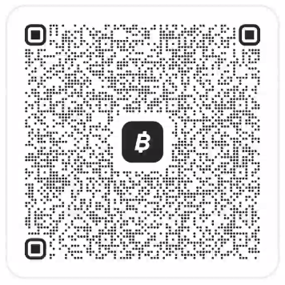

# ZeroClaw Commerce & ZeroClaw Kraken Automagic Trading Bot 

One multi-channel intergration and the other fully local and using the same framework at the same time!🛡️


[](https://github.com/sponsors/thepros2014)

Welcome to **ZeroClaw Commerce** — the zero-key payment, tax accounting, conversational AI cashier, and digital fulfillment platform for the ZeroClaw agent ecosystem.

ZeroClaw Commerce provides `wasm32-wasip2` plugins, an async FastAPI Gateway, multi-channel bots (Telegram, WhatsApp, Discord), double-clickable launchers, intelligent natural language NLU cashier chat, real-time customer feedback inboxes, inventory stock management, and a real-time **Merchant Sales & Security Dashboard** with 6-digit PIN protection.

---

## ✨ Key Features & Capability Matrix

| Feature | Description |
| :--- | :--- |
| **🤖 Natural Speech NLU AI Cashier** | Chat naturally with buyers (`"I want to buy the eBook"`), auto-match SKUs, and launch zero-key Solana Pay invoices directly inside chat. |
| **📬 Private Merchant Inbox (5s Auto-Sync)** | Real-time customer feedback & concern collection with 5-second automatic dashboard polling and `Mark Reviewed` resolution actions. |
| **🌐 Universal 100% Wallet Compatibility** | Rendered Solana Pay URIs & QR Codes work with Phantom, Solflare, Backpack, Coinbase, Trust Wallet, Exodus, Ultimate, Brave, OKX, Ledger & ALL Solana wallets. |
| **📷 In-Chat Solana Pay QR Code Photos** | Renders 300x300 high-resolution Solana Pay QR Code image photos directly in Telegram chats and dashboard checkout modals. |
| **📦 Storefront Inventory Stock Editor** | Manage product titles, SKUs, prices, stock quantities, and descriptions directly from the dashboard behind 6-Digit Admin PIN protection. |
| **🔒 6-Digit Security PIN & Employee RBAC** | Restrict privileged tax exports & storefront edits with a 6-digit keypad modal. Supports `Store Admin` and restricted `Cashier/Staff` roles. |
| **⚙️ First-Time Merchant Setup Wizard** | Interactive `/setup` onboarding with per-channel `⚙️ Configure Now` vs `⏭️ Skip for Later` controls, saved to persistent `config.json`. |
| **🧾 Dual IRS ($USD) & Receita Federal (R$BRL) Tax Ledger** | Real-time cost-basis tax logging with automated Form 8949 compliance and CSV ledger exports. |
| **🛡️ Tier 1 Zero-Key Custody Architecture** | Bot and agent hold **ZERO private keys**. Transactions are proposed via Solana Pay and signed on consumer mobile devices. |
| **🖱️ Automagic Master All-In-One Launcher** | Double-click `Start_ZeroClaw_Commerce.cmd` to start gateway, provision bots, and open `/dashboard` or `/setup` automatically. |

## 🐙 Kraken AI: Dual-Dashboard Architecture

ZeroClaw Commerce now supports a **Dual-App Architecture**, running the e-commerce storefront and a powerful Reinforcement Learning (PPO) Crypto Trading Bot side-by-side using the same underlying ZeroClaw ecosystem!

The **Kraken AI Trading Engine** leverages the core ZeroClaw environment (shared Python virtual environments, unified configuration file handling, and FastAPI architecture) but operates completely independently on its own port.

### How the Trading Bot Uses ZeroClaw:
- **Environment Isolation**: Uses the exact same isolated `.venv` provisioned by ZeroClaw's automated installers.
- **Config State**: Saves its API keys and hyperparameters to the shared root `config.json`, allowing the engine to persist state exactly like the e-commerce setup wizard.
- **Dashboard API**: Duplicates the `fastapi-gateway` model to spin up a specialized, stripped-down Trading Dashboard (Port 8001) for monitoring RL training metrics and open positions.
- **No Conflicts**: By running on a separate port (8001) and using a dedicated launcher (`Start_Kraken_AI.cmd`), the Trading Bot does not interfere with the E-Commerce Storefront (Port 8000).

---

## 📂 Repository Directory Structure

```text
zer0claw/
├── docs/                       <-- Consolidated Documentation
│   ├── SUBMISSION.md           <-- Official Superteam Bounty Submission
│   ├── ROADMAP_FUTURES.md      <-- Master 5-Year Futures Plan & TODO Roadmap (2026-2030)
│   ├── ARCHITECTURE.md         <-- Technical Architecture & 6-Layer Security
│   ├── VISION.md               <-- Strategic Roadmap & Enterprise Vision
│   ├── TELEGRAM_BOT.md         <-- Telegram Storefront Setup & NLU Commands
│   └── MULTI_CHANNEL.md        <-- Discord Slash Commands & WhatsApp Webhook
├── fastapi-gateway/            <-- Async REST Gateway (E-Commerce / Port 8000)
│   ├── app/
│   │   ├── main.py             <-- FastAPI Endpoints, Feedback Store & Disk Config
│   │   ├── models.py           <-- Pydantic V2 Schemas & Hashes
│   │   ├── solana.py           <-- Multi-RPC Solana Client & Reference Generator
│   │   └── static/
│   │       ├── index.html      <-- Merchant Dashboard (PIN Modal, Inventory & Inbox)
│   │       └── setup.html      <-- First-Time Setup Wizard (Per-Channel Controls)
│   └── requirements.txt
├── trading-dashboard/          <-- AI Trading Dashboard API (Trading / Port 8001)
│   ├── app/
│   │   ├── main.py             <-- AI Metrics Endpoints & Setup Saves
│   │   └── static/
│   │       ├── dashboard.html  <-- Live AI Activity Log & PnL
│   │       └── setup.html      <-- Kraken Auth & Target Pair Setup
│   └── requirements.txt
├── telegram-bot/               <-- Telegram Storefront Bot Application
│   ├── bot.py                  <-- Async Bot, NLU Natural Speech Engine & Deep Links
│   └── requirements.txt
├── kraken-bot/                 <-- Kraken AI Margin Trading Engine (PPO RL Model)
│   ├── bot.py                  <-- Live Execution Engine
│   ├── model_trainer.py        <-- PyTorch RL Trainer
│   └── requirements.txt
├── skills/                     <-- Official Zer0claw Skill Manifest
│   └── solana-commerce/
│       └── SKILL.md            <-- Skill Manifest & Standard Operating Procedure (SOP)
├── zeroclaw-solana/            <-- WASM Risk Engine & Solana Pay Crate (Rust)
├── zeroclaw-accounting/        <-- WASM Dual-Currency Tax Accounting Crate (Rust)
├── zeroclaw-memory/            <-- Flat-file Durable Memory Crate (Rust)
├── zeroclaw-api/               <-- Core Plugin WIT Interfaces (Rust)
├── mock-cli/                   <-- Interactive Developer Demo CLI (Rust)
├── Start_ZeroClaw_Commerce.cmd <-- E-Commerce Master Launcher (Port 8000)
├── Start_Kraken_AI.cmd         <-- AI Trading Master Launcher (Port 8001)
├── install_bots.ps1            <-- E-Commerce Dependency Installer
├── install_kraken_ai.ps1       <-- AI Trading Dependency Installer
├── install_bots.sh             <-- Automated Bot Dependency Installer (Mac/Linux)
└── README.md                   <-- Front Page Overview & Repository Sitemap
```

---

## 🚀 Quickstart & Startup Commands

### 🖱️ 1. Windows Automagic Launch (Recommended)
Simply **double-click** `Start_ZeroClaw_Commerce.cmd` in the repository root directory!
- Starts FastAPI Commerce Gateway on `http://127.0.0.1:8000`
- Provisions Python bot virtual environments
- Launches Storefront Bots
- Opens `/dashboard` (or `/setup` if first run) in your default web browser!

### 💻 2. Mac / Linux Launch
```bash
# Make installer executable & launch
chmod +x install_bots.sh
./install_bots.sh

# Start FastAPI Gateway
cd fastapi-gateway
python3 -m uvicorn app.main:app --host 127.0.0.1 --port 8000 &

# Start Telegram Bot
cd ../telegram-bot
python3 bot.py
```

---

## 💬 Natural Speech NLU AI Cashier Commands

Buyers can interact with the Telegram bot using slash commands or natural language text:

| Command / Natural Chat | Action |
| :--- | :--- |
| `Hi! What do you sell?` / `/catalog` | Views full digital catalog with prices in USDC/SOL. |
| `I want to buy the eBook` / `/buy SKU_EBOOK_PDF` | Generates zero-key Solana Pay invoice + QR Code photo + multi-wallet links. |
| `/verify <invoice_id> <tx_signature>` | Verifies transaction on-chain & delivers instant digital fulfillment token. |
| `/feedback <message>` / `I have a concern...` | Submits private buyer feedback directly to the owner's Dashboard Inbox. |
| `/help` | Explains Tier 1 zero-key custody model and security architecture. |

---

## 🔒 Custody Tier: 1 (Proposer-Only)
This framework explicitly operates in **Tier 1 Zero-Key Custody**. The LLM and server process hold **zero private keys**. The agent acts strictly as a transaction proposer, returning a Solana Pay URI for human authorization via Phantom, Solflare, Backpack, Coinbase, Trust Wallet, Exodus, or Ledger.

---

## 📚 Documentation Index (`docs/`)

- **[🏆 SUBMISSION.md](./docs/SUBMISSION.md)**: Official Superteam Bounty Submission Breakdown & Rubric Alignment.
- **[🚀 ROADMAP_FUTURES.md](./docs/ROADMAP_FUTURES.md)**: Master 5-Year Futures Plan, Feature TODO List & Multi-Year Vision (2026-2030).
- **[🛡️ ARCHITECTURE.md](./docs/ARCHITECTURE.md)**: Technical Architecture, WASM Plugins, & 6-Layer Security Model.
- **[🔮 VISION.md](./docs/VISION.md)**: Strategic Expansion Roadmap & Institutional Squads Multisig Bridge.
- **[🤖 TELEGRAM_BOT.md](./docs/TELEGRAM_BOT.md)**: Telegram Storefront Bot Setup, Commands, & NLU Natural Chat.
- **[🌐 MULTI_CHANNEL.md](./docs/MULTI_CHANNEL.md)**: Discord Slash Commands & WhatsApp Cloud API Webhook Guide.

---

## 💖 Sponsor & Support ZeroClaw Commerce

If you find ZeroClaw Commerce valuable for your storefront, business, or agent workflows, please consider supporting open-source development!

- **💖 GitHub Sponsors**: [Sponsor `@thepros2014` on GitHub](https://github.com/sponsors/thepros2014)
- **⚡ Solana Wallet (SOL / USDC Tips)**: `FWuAvPKkLxzG47Rygu19NAHLNjUt3y65xyH3NHBwKZUM`
- **⚡ Bitcoin On-Chain Address**: `bc1qncatkksau6f4tnt24ghdzqw6xmfm4nqkrp8gjt`
- **⚡ BTC / Bitcoin Lightning QR Code**: Scan QR Code below or copy Lightning invoice to tip via Bitcoin/Lightning!

<p align="left">
  
</p>

- **⭐ Star the Repo**: Show your support by giving us a star on [GitHub](https://github.com/thepros2014/zer0claw)!

